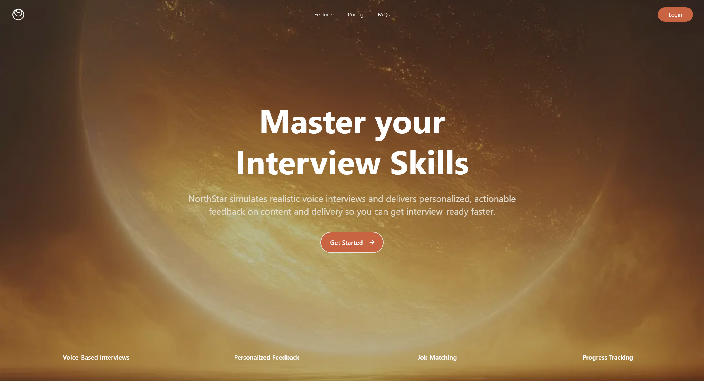

# NorthStar

[](https://ovoxa.vercel.app/)

**NorthStar** is a GenAI role-play platform that simulates voice-based interviews and delivers targeted, actionable feedback personalized for each user. We help university students practice effectively and improve faster through AI-powered interview simulations.

## 🎯 What We Do

NorthStar analyzes both speech content and delivery to provide comprehensive feedback on:

- 🗣️ **Speech Content**: Relevance, structure, and completeness of answers
- 🎤 **Speech Delivery**: Filler words, pauses, pace, and clarity
- 🎯 **Role Alignment**: How well answers match the specific job requirements
- 💼 **Company Fit**: Tailored feedback based on company culture and values

From software engineering roles at tech giants to consulting positions at top firms, we cover the positions that matter most to university students entering the job market.

## 🛠️ Tech Stack

- **Frontend**: [Next.js](https://nextjs.org) (App Router)
- **Backend**: [Supabase](https://supabase.com) (Database, Authentication, Storage)
- **AI Integration**: Voice-based GenAI for interview simulation, Mistral API for data extraction
- **Web Scraping**: Firecrawl for automated job posting extraction
- **UI Components**: Shadcn/ui with Tailwind CSS
- **TypeScript**: Full type safety across the application

## 🚀 Getting Started

### Prerequisites

- Node.js 18+ or Bun
- Supabase account and project

### Installation

1. Clone the repository:

```bash
git clone https://github.com/Spagestic/NorthStar.git
cd NorthStar
```

2. Install dependencies:

```bash
bun install
# or
npm install
```

3. Set up environment variables:

```bash
# Create a .env.local file with your Supabase credentials
NEXT_PUBLIC_SUPABASE_URL=your_supabase_url
NEXT_PUBLIC_SUPABASE_ANON_KEY=your_supabase_anon_key
```

4. Generate TypeScript types from your Supabase database:

```bash
# Install Supabase CLI as a dev dependency
bun i supabase@">=1.8.1" --save-dev

# Login with your Personal Access Token
npx supabase login

# Initialize Supabase project (first time only)
npx supabase init

# Generate types from your remote Supabase project
npx supabase gen types typescript --project-id "$PROJECT_REF" --schema public > database.types.ts

# OR for local development:
npx supabase gen types typescript --local > database.types.ts
```

5. Run the development server:

```bash
bun dev
# or
npm run dev
```

6. Open [http://localhost:3000](http://localhost:3000) in your browser

## 📁 Project Structure

```
app/
├── (protected)/          # Authenticated routes
│   ├── dashboard/        # Job URL pasting & automated scraping (Firecrawl + Mistral)
│   ├── jobs/             # Job listing and filtering
│   ├── interview/        # AI interview interface
│   ├── history/          # Past interview sessions and feedback
│   └── profile/          # User profile and settings
├── (public)/             # Public landing page
├── auth/                 # Authentication flows
└── api/                  # API routes

components/
├── auth/                 # Authentication components
├── jobs/                 # Job listing components
├── sidebar/              # Navigation components
└── ui/                   # Reusable UI components

lib/
└── supabase/             # Supabase client configuration
```

## ✨ Key Features

- 🔗 **Instant Job Import**: Paste any job URL to automatically scrape (via Firecrawl) and extract requirements (via Mistral API) for instant mock interview setup.
- 🎙️ **Voice-Based Interviews**: Realistic AI-powered interview simulations
- 📈 **Personalized Feedback**: Detailed analysis of your interview performance
- 🔍 **Smart Job Matching**: Browse and filter through 100+ curated positions
- 🏢 **Company-Specific Prep**: Questions tailored to specific companies and industries
- 📊 **Progress Tracking**: Monitor your improvement over time
- 🎯 **Role-Specific Questions**: Targeted practice for your desired position

## 🤝 Contributing

We welcome contributions! Please feel free to submit a Pull Request.

## 📄 License

This project is licensed under the MIT License - see the LICENSE file for details.

## 🙏 Acknowledgments

Built with ❤️ for university students preparing for their dream jobs.
